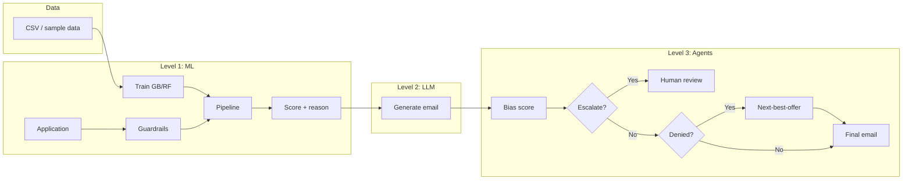

# LoanSense

A three-level AI loan approval project: **ML scoring** → **LLM email (with reason)** → **AI agents with guardrails** (bias detection, next-best-offer). The ML decision and a short reason (e.g. debt-to-income, credit score) are passed to the LLM so the customer email explains why they were approved or denied. Built to showcase production-ready AI skills for recruiters.

## Project structure

```
LoanSense/
├── app.py                 # Streamlit UI (train, score, email/agent)
├── scripts/               # CLI: train, score, generate_email, run_agent_pipeline
├── src/
│   ├── data/              # Load CSV/sample, preprocess, feature engineering
│   ├── models/            # Train (GB/RF), evaluate, predict, save pipeline
│   ├── llm/               # LLM client (OpenAI/Anthropic), email generation
│   ├── agents/            # Bias detection, next-best-offer, pipeline
│   ├── utils/             # Structured logging (LOG_LEVEL, ENV)
│   └── api/               # FastAPI: /score, /generate-email, /agent-pipeline, /health
├── tests/                 # Pytest suite (data, models, llm, agents, API)
├── data/                  # Optional: loan_data.csv
└── models/                # Saved pipeline (after train)
```

## Levels

| Level | What it does |
|-------|----------------|
| **1. Beginner** | Gradient Boosting (and Random Forest) model for approve/deny; train/validation/test splits; feature engineering; simple deployment API. |
| **2. Intermediate** | LLM takes the ML decision and an optional **reason** (from the model/features) and generates a personalized email explaining the outcome (adds probabilistic component). |
| **3. Advanced** | Agent detects bias/discrimination in the email → scores it → escalates to human or re-runs through a stricter agent; optional next-best-offer agent for denied applicants. |

**Agent / LLM:** LLM calls go through a unified client that supports **OpenAI** (default) or **Anthropic** via `LLM_PROVIDER=openai|anthropic` in `.env`; set `OPENAI_API_KEY` and/or `ANTHROPIC_API_KEY` accordingly. Default models: `gpt-4o-mini` (OpenAI), `claude-3-5-sonnet-20241022` (Anthropic). The client uses retries with backoff and structured logging (e.g. `email_generated`, `bias_score`, `escalated`). The “agent pipeline” is three steps: (1) generate customer email, (2) **bias agent** scores that email and can escalate to human, (3) for **denied** applicants a **next-best-offer agent** suggests an alternative and appends it to the email.

## Architecture



## Skills demonstrated

- Data analysis, preprocessing, feature engineering  
- ML model training (Gradient Boosting, Random Forest), validation, testing  
- Deployment (API, scoring in production)  
- LLM integration and prompt design  
- AI agents, guardrails, bias detection  
- Deterministic vs probabilistic system design  

## Setup

**Option A — Local (venv)**  
```bash
python -m venv .venv
.venv\Scripts\activate   # Windows
pip install -r requirements.txt
cp .env.example .env    # Add OPENAI_API_KEY and/or ANTHROPIC_API_KEY for Level 2/3
```

**Option B — Docker**  
No venv needed. Install [Docker](https://docs.docker.com/get-docker/) and have a `.env` (copy from `.env.example`). Build and run below.

## Usage

### How to start the app (starting commands)

| Run mode | Command | What you get |
|----------|---------|----------------|
| **Local — UI only** | `streamlit run app.py` | Streamlit at http://localhost:8501 (train, score, email/agent in the browser). |
| **Local — API only** | `uvicorn src.api.main:app --reload` | API at http://127.0.0.1:8000 (docs at /docs). |
| **Local — API + UI** | Run the two commands above in separate terminals. | Both API and Streamlit. |
| **Docker — API + UI** | `docker compose up --build` | API at http://localhost:8000, Streamlit at http://localhost:8501. One command starts both. |
| **Docker — UI only** | `docker build -t loansense .` then `docker run -p 8501:8501 --env-file .env loansense` | Streamlit only at http://localhost:8501. |

On Windows PowerShell (local runs), set the project root in Python path first:
```powershell
$env:PYTHONPATH = (Get-Location).Path
```

### Level 1: Train and run ML model

```bash
# Train (uses sample data or your CSV; omit --data to generate sample data)
python scripts/train.py --data data/loan_data.csv

# Score one application (deployment simulation)
python scripts/score.py --income 50000 --debt 10000 --employment_years 5 --credit_score 650
```

### Level 2: Generate email with LLM

```bash
python scripts/generate_email.py --decision approve --applicant_name "Jane Doe"
```

### Level 3: Full agent pipeline (bias check + next-best-offer)

```bash
python scripts/run_agent_pipeline.py --decision deny --applicant_name "Jane Doe"
```

### API (optional)

```bash
uvicorn src.api.main:app --reload
```

Interactive API docs: **http://127.0.0.1:8000/docs**

**Connected flow:** `POST /score-and-email` — send application + applicant name; get ML decision, reason, and LLM-generated email in one call (optionally with agent pipeline).

### Web UI (Streamlit)

```bash
streamlit run app.py
```

Opens a browser: **train** (sample data), **score** an application, and (if `OPENAI_API_KEY` or `ANTHROPIC_API_KEY` is set) generate customer emails or run the full agent pipeline.

### Docker details

- **Compose** mounts `./models` and `./data` so a trained pipeline and CSV persist between runs. Pass your keys via `--env-file .env`.
- **Health check:** `GET http://localhost:8000/health` returns `status`, `model_loaded`, and `llm_configured`.
- **Optional API auth:** Set `API_KEY` or `LOANSENSE_API_KEY` in `.env` to require the `X-API-Key` header on `/score`, `/score-and-email`, `/generate-email`, and `/agent-pipeline`. If unset, those endpoints are open.
- Optional in `.env`: `ENV=development`, `LOG_LEVEL=INFO` (or `DEBUG`) for structured logging.

## Testing

Run the test suite (from project root, with `PYTHONPATH` set as above):

```bash
python -m pytest tests/ -v
```

All tests use mocks for the LLM client, so no API key is required. An integration test (`tests/test_integration.py`) runs the full flow (score → email → agent pipeline) with mocked completions. Level 2/3 scripts require a valid `OPENAI_API_KEY` or `ANTHROPIC_API_KEY` in `.env`.

## Data

- **Sample data:** Training without `--data` uses **synthetic** data (see `src/data/load.py`). Debt is mostly 5–50% of income, with ~15% high-debt cases (up to 2× income) so the model sees deny examples. This is enough for a realistic demo but not for production.
- **Real data (UCI Credit):** For a public dataset, use the included download script (maps [UCI Credit Approval](https://archive.ics.uci.edu/ml/datasets/credit+approval) to the LoanSense schema):
  ```bash
  python scripts/download_loan_data.py
  python scripts/train.py --data data/loan_data.csv
  ```
  This fetches ~690 anonymized credit records, maps them to `income`, `debt`, `employment_years`, `credit_score`, `loan_amount`, `savings_balance`, `approved`, and saves `data/loan_data.csv`. You can then train from the UI (sidebar: "Train from CSV") or CLI as above.
- **Your own CSV:** Place any CSV at `data/loan_data.csv` with columns: income, debt, employment_years, credit_score, loan_amount, savings_balance, approved. Adjust `src/data/schema.py` if your column names differ.
- **Guardrails:** To avoid obviously bad approvals (e.g. debt >> income or very low credit), **rule-based guardrails** run before the model: DTI > 50% or credit score < 400 always result in **denied** with a clear reason, even if the model would have approved. See `apply_guardrails()` in `src/models/predict.py`.

## Resume bullets (copy-paste)

- Built an end-to-end **loan approval AI system**: ML (Gradient Boosting / Random Forest) with 80/10/10 train/validation/test splits, feature engineering, and deployment via REST API and Streamlit UI.
- Integrated **LLMs** to turn model decisions into customer-facing emails (with explainable reasons), then added **guardrails**: bias-detection agents, escalation to human review, and next-best-offer for denied applicants.
- Demonstrated **deterministic vs probabilistic** design: interpretable ML scoring plus safe use of LLMs with bias scoring and agent pipelines; wrote tests and CI (pytest, GitHub Actions).

## License

MIT
